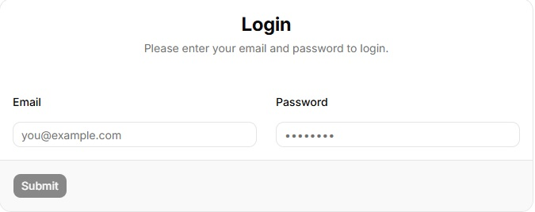
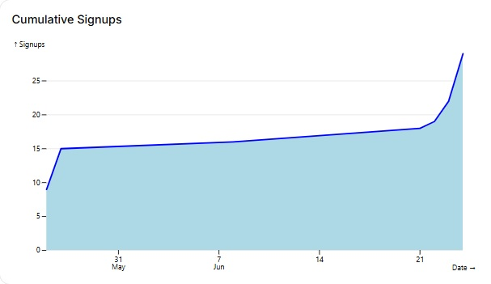
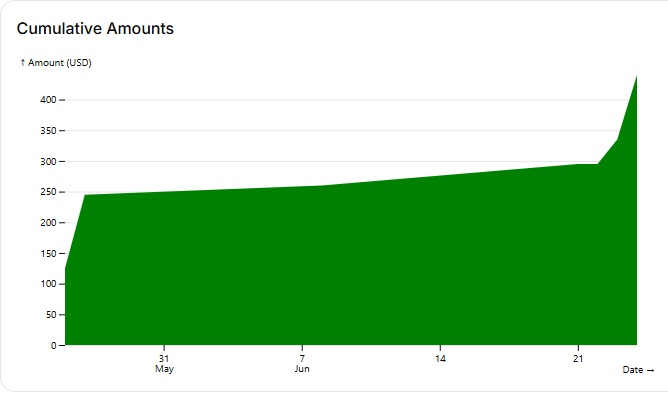
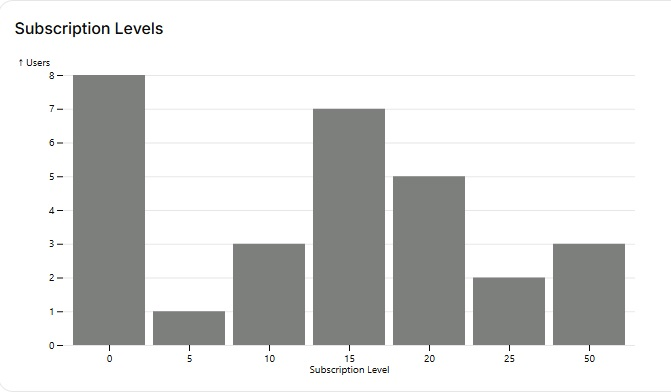
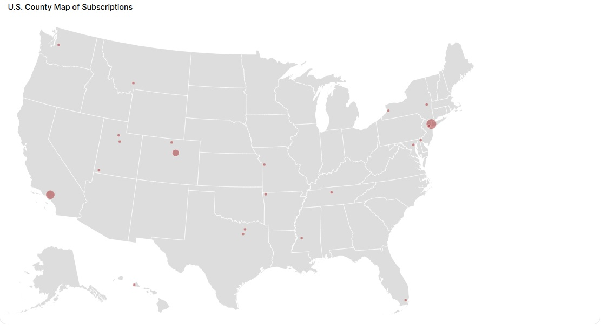

# React Newsletter Subscription

A newsletter subscription form for U.S.-based subscribers, with different subscription levels and email verification, and an analytics page. It uses React v19, Node.js v24, and MySQL v8.

## Signup Form

The signup form has fields for first name, last name, email, password, confirm password, phone number, street address1, street address2, state, county, zip code, and a selection of different subscription levels. Here are the levels:

1)	Free
2)	$5/month
3)	$10/month
4)	$15/month
5)	$20/month
6)	$25/month
7)	$50 month (max)


Phone number and street address2 aren’t required. Hitting the submit button on this page triggers the server to make sure the email is not already in database. If the email is unique, the user record is added to the database with the verified field set to false.

## Email Verification Form

There is an email verification involving sending a verification code. 


After email is verified by being entered in a form, the screen displays a message saying that the user has been successfully added as a subscriber (ignoring payments). The verified field is set to true.


## Admin Feature with Analytics
There is an admin feature with Analytics that is restricted to users with the "admin_authorized" database field set to true. Manually navigating to /admin triggers a nested route:
```typescript
route('/admin', 'routes/require-admin.tsx', [
    index('routes/admin.tsx')
  ]),
  ```
The parent route require-admin.tsx calls useSyncExternalStore() to execute methods from /services/authStore.ts to confirm authentication using local boolean variable adminAuthorized. If not authorized, require-admin.tsx redirects the user to a login page



After the user logs in, the server reads the user record and checks for valid password. If password is valid, the JWT token is signed, and the token and adminAuthorized field is sent to the front end. The front end login.tsx navigates to admin.tsx if adminAuthorized is true. If adminAuthorized is not true, or the email or password is invalid, the login screen returns a meaningful error message.

The admin page admin.tsx hits an api/analytics endpoint for a database query and also fetches json data stored on the server for the bubble map. The server first authenticates the JWT token in the request header before running the database query. Data is returned for users who are verified subscribers. The analytics page has 4 charts:

1) Cumulative Signups Area Chart



2) Cumulative Amounts Area Chart



3) Subscription Levels Histogram



4) U.S. Bubble Map Showing Geographic Distribution of Subscribers by County



All charts use Observable Plot, and the bubble map also uses D3.

This is a React/Typerscript app with Axios/TanStack Query for http calls, Zod for back and front end schema, React Hook Form and Shadcn/UI for the signup and email verification forms, React Router/Vite for package builder, Node/Express for server, Nodemailer for sending emails, bcrypt for encrypting passwords & OTP codes, JWT for handling login authentication, and a MySQL database to store the form information to and perform queries for the analytics. There are 4 routes: signup, email-verification, admin, and login. Signup is the default route.

Technologies used:
React, TypeScript, Lodash, Axios, TanStack Query, Observable Plot, D3, Zod/React Hook Form, React Router/Vite, Shadcn/UI,  Node.js, Express, JWT, MySQL.

AI's used in development:
Cursor, Copilot, Google AI

