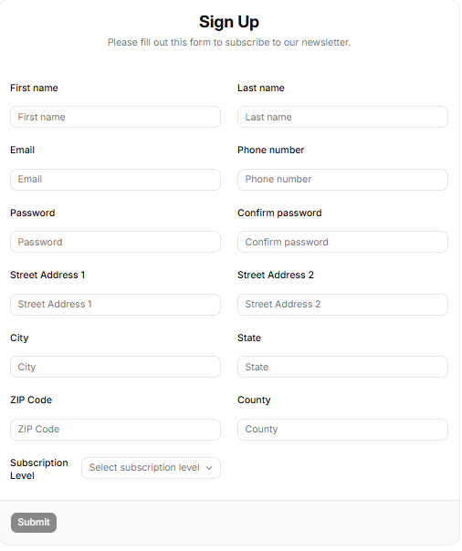
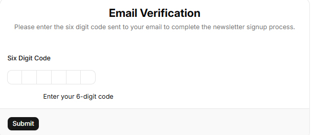
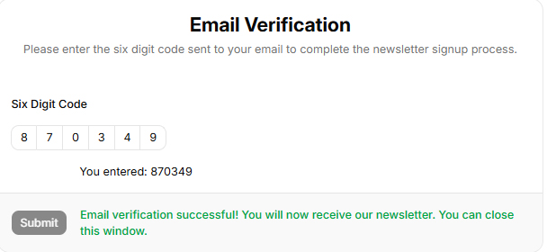

# React Newsletter Subscription

A newsletter subscription form for U.S.-based subscribers, with different subscription levels and email verification, and an analytics page. It uses React v. 19+, Node.js v. 24+, and MySQL v. 8+.

## Requirements

The signup form hase fields for first name, last name, email, password, confirm password, phone number, street address1, street address2, state, county, zip code, and a selection of different subscription levels. Here are the levels:

1)	Free
2)	$5/month
3)	$10/month
4)	$15/month
5)	$20/month
6)	$25/month
7)	$50 month (max)

Phone number and street address2 aren’t required. Hitting the submit button on this page will trigger the server to make sure the email is not already in database. If the email is unique, the user record will be added to the database with the verified field set to false. There will be an email verification involving sending a verification code. 

After email is verified by being entered in a form, the screen will display a message saying that the user has been successfully added as a subscriber (ignoring payments). The verified field will be set to true.

This is a React/Typerscript app with Axios/TanStack Query for http calls, Zod for back and front end schema, React Hook Form and Shadcn/UI for the signup and email verification forms, React Router/Vite for package builder, Node/Express for sever, Nodemailer for sending emails, bcrypt for encrypting OTP codes, and a MySQL database to store the form information. There are two routes: signup & email-verification. Signup is the default route.

Technologies used:
React, TypeScript, Lodash, Axios, TanStack Query, Zod/React Hook Form, React Router/Vite, Shadcn/UI,  Node.js, Express, MySQL.

AI's used in development:
Cursor, Copilot, Google AI

